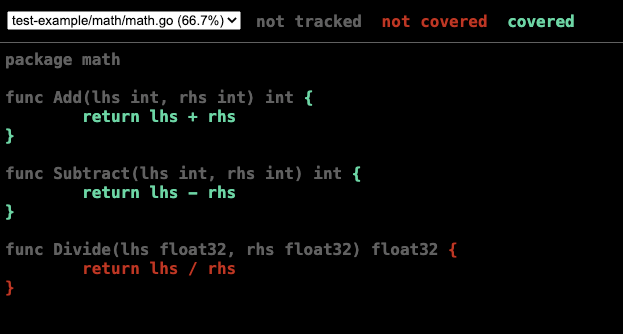

## Why we test

It's good to test your code to ensure it works as intended. In this chapter we're looking at unit tests specifically. 

## What Go provides

Go has a package `testing` that gives us two things to start out with:

- a parameter for the test. The `testing` library exposes a `t *testing.T` parameter. By putting it as a parameter to a function, said function becomes a test.

   ```go
   func TestAdd(t *testing.T) {}
   ```

- a way to assert the result. `testing` also exposes `t.Errorf()`. By invoking it with a string, the test counts as failed. To pass a test you do nothing:

   ```go
   t.Errorf("Sum was incorrect, Actual: %d, Expected: %d", total, 4)
   ```

Here's an example test function:

```go
func TestAdd(t *testing.T) {
 total := Add(2, 2)
 if total != 4 {
  t.Errorf("Sum was incorrect, Actual: %d, Expected: %d", total, 4)
 }
 t.Log("running TestAdd")
}
```

- First, the code to test is called:

   ```go
   total := Add(2, 2)
   ```

- Secondly, the assertion is made, to see if it succeeded or failed:

   ```go
   if total != 4 {
     t.Errorf("Sum was incorrect, Actual: %d, Expected: %d", total, 4)
   }
   ```

   if the result is not the expected, then `t.Errorf()` is called to state what's gone wrong.

## Your first test

Make sure you've created a project with `go mod init`. Then create a file structure like so:

```output
main.go
math/
  math.go
```

What you want to do next is to create a test file. You want to keep the test file as close to the code you want to test as possible. Because you want to test *math.go* you create `math_test.go` file in the math/ directory like so:

```output
main.go
math/
  math.go
  math_test.go
```

### Authoring and running your first test

Now that you have the file structure above, ensure the *math_test.go* file has the following content:

```go
package math

import (
 "testing"
)

func TestAdd(t *testing.T) {
  total := Add(2, 2)
  if total != 4 {
    t.Errorf("Sum was incorrect, Actual: %d, Expected: %d", total, 4)
  }
  t.Log("running TestAdd")
}
```

To run a test, you invoke the `go test` command. Here's different ways to run your tests:

- `go test`, runs the test in the current working directory. Here's what it looks like:

   ```output
   ok      test-example/math       0.258s
   ```

- `go test -v`, runs a verbose version. Here's what it can look like:

   ```output
   === RUN   TestAdd
    math_test.go:12: running TestAdd

   --- PASS: TestAdd (0.00s)
   PASS
   ok      test-example/math       0.422s
   ```

   In the verbose version, you see the name of the test and if it failed.

- `go test ./..`, recursive run. If you run the command like so it will run all the tests in the sub folders as well. 

## Control the test run

There are ways to control how many tests are run. Here are some ways:

  - **Run test by pattern**. . You can provide a pattern to have Go run some of the tests, that matches it by a sub string or even at a certain depth and more. Here's how:
  
    ```console
    go test -run <pattern>
    ```

  - **Skip a test**. `t.Skip()` by calling this inside the test, the test is skipped.
- **Run a single test**. You can run a single test by running a pattern that specifies the package and the name of the test, here's how:

   ```console
   go test -run TestAdd ./math
   ``` 

   Here's the package is called math and the name of the test is `TestAdd()`.

## Coverage

There's a built-in tool for dealing with coverage. To learn more about the tool, you can type:

```console
go tool cover -help
```

it will list a set of commands.

The tool is centred on the concept of having an out file. The out file contains instructions on where your code is covered by tests and where it isn't. An out file can look something like this:

```output
mode: set
test-example/math/math.go:3.32,5.2 1 1
test-example/math/math.go:7.37,9.2 1 1
test-example/math/math.go:11.47,13.2 1 0
```

This is a format readible by the tool.

It's a prerequisite to generate said out file before you can view your code's coverage. Place yourself in the directory you mean to measure coverage on and run this command:

```console
go test -coverprofile=c.out
```

Now you are ready to run a command that shows the result in a browser:

```console
go tool cover -html=c.out
```

The above command spins up a browser and the output looks something like so:



The coverage report tells us that the the green portions are covered by tests whereas the red portions should have tests covering it.

## Learn more 

There's a lot more to learn on testing with Go, have a look at package documentation, [docs](https://pkg.go.dev/testing)
